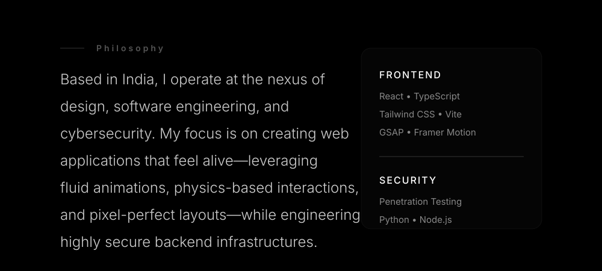

  

  

  

   
  <picture>
    <source media="(prefers-color-scheme: dark)" srcset="https://github-readme-stats-sigma-five.vercel.app/api?username=gokulkannanganesamoorthy&show_icons=true&theme=transparent&hide_border=true&title_color=fff&text_color=ccc&icon_color=fff&bg_color=00000000" />
    <source media="(prefers-color-scheme: light)" srcset="https://github-readme-stats-sigma-five.vercel.app/api?username=gokulkannanganesamoorthy&show_icons=true&theme=transparent&hide_border=true&title_color=111&text_color=333&icon_color=111&bg_color=00000000" />
    
  </picture>
  &nbsp;&nbsp;&nbsp;&nbsp;&nbsp;&nbsp;&nbsp;
  <picture>
    <source media="(prefers-color-scheme: dark)" srcset="https://github-readme-stats.vercel.app/api/top-langs/?username=gokulkannanganesamoorthy&layout=compact&theme=transparent&hide_border=true&title_color=fff&text_color=ccc" />
    <source media="(prefers-color-scheme: light)" srcset="https://github-readme-stats.vercel.app/api/top-langs/?username=gokulkannanganesamoorthy&layout=compact&theme=transparent&hide_border=true&title_color=111&text_color=333" />
    
  </picture>

  <picture>
    <source media="(prefers-color-scheme: dark)" srcset="https://github.com/gokulkannanganesamoorthy/gokulkannanganesamoorthy/blob/output/github-contribution-grid-snake-dark.svg" />
    <source media="(prefers-color-scheme: light)" srcset="https://github.com/gokulkannanganesamoorthy/gokulkannanganesamoorthy/blob/output/github-contribution-grid-snake.svg" />
    
  </picture>

 
 
 

  <a href="https://gokulkannanganesamoorthy.vercel.app">
    <picture>
      <source media="(prefers-color-scheme: dark)" srcset="https://cdn.simpleicons.org/vercel/ffffff" />
      <source media="(prefers-color-scheme: light)" srcset="https://cdn.simpleicons.org/vercel/111111" />
      
    </picture>
  </a>
  &nbsp;&nbsp;&nbsp;&nbsp;&nbsp;&nbsp;&nbsp;&nbsp;&nbsp;
  <a href="https://www.linkedin.com/in/gokulkannanganesamoorthy/">
    <picture>
      <source media="(prefers-color-scheme: dark)" srcset="https://cdn.simpleicons.org/linkedin/ffffff" />
      <source media="(prefers-color-scheme: light)" srcset="https://cdn.simpleicons.org/linkedin/111111" />
      
    </picture>
  </a>
  &nbsp;&nbsp;&nbsp;&nbsp;&nbsp;&nbsp;&nbsp;&nbsp;&nbsp;
  <a href="mailto:contact@gokulkannan.dev">
    <picture>
      <source media="(prefers-color-scheme: dark)" srcset="https://cdn.simpleicons.org/gmail/ffffff" />
      <source media="(prefers-color-scheme: light)" srcset="https://cdn.simpleicons.org/gmail/111111" />
      
    </picture>
  </a>

 
 
